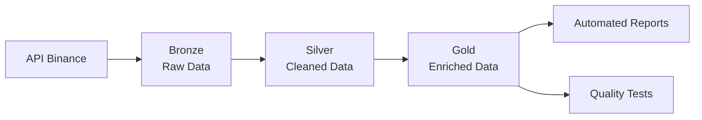

# **Data Engineering Project: Binance ETL Pipeline with Delta Lake (Medallion Architecture)**

## Overview
Complete data engineering pipeline that processes financial data from Binance API in almost-real time, deploying Madallion architecture with Delta Lake for quality assurance, scalability and maintainability.


## The Story Behind This Project

This project was born behind the necesity of processing financial data in real time with quality warranties. I deployed a pipeline capable of:

- **Extract** data from multiple endpoints from Binance API
- **Transforms** and cleans data using Pandas
- **Loads** in Data Lake format using Medallion architecture
- **Generates** authomatic quality reports



## Arcitecture Deep Dive

### Data Lakehouse Structure
```bash
data/
├── bronze/ # Raw data from the API
├── silver/ # Trasformed, cleaned data
└── gold/ # Aggregated data for analisys
```
## Key Design Desicions
- Medallion architecture for progresive quality management
- Delta Lake for ACID compliance and time travel
- Incremental processing for efficiency
- Automated quality checks with ydata-profiling

## Implementation Details: Code Quality & Best Practices
### Modern Path Management with Pathlib

I implemented a robust path management system using `pathlib` to ensure portability between operating systems:
```python
"""
Path configuration for Binance API data pipeline.
Use 'pathlib' for better path management between systems.
"""
from pathlib import Path
#----------------------------------------------
# Base project dir
#----------------------------------------------
BASE_DIR = Path(__file__).resolve().parent.parent
#----------------------------------------------
# Metadata
#----------------------------------------------
INCREMENTAL_DIR = Path("metadata") / "incremental.json"
CARPETA_INCREMENTAL = INCREMENTAL_DIR.parent
ARCHIVO_INCREMENTAL = INCREMENTAL_DIR.name
```

### Professional Logging System

I set up a complete logging system with different levels and handlers for monitoring in production:
```python
def setup_logging(tipo_extraccion:str, level:int=logging.INFO) -> None:
    """Configuración centralizada de logging"""
    
    base_dir = Path(__file__).resolve().parent.parent
    log_dir = base_dir / 'logs' / tipo_extraccion
    log_dir.mkdir(parents=True, exist_ok=True)
    
    logging.basicConfig(
        level=level,
        format='%(asctime)s - %(name)s - %(levelname)s - %(message)s',
        handlers=[
            logging.FileHandler(log_dir / f"pipeline_{datetime.now().strftime('%Y%m%d')}.log"),
            logging.StreamHandler()
        ]
    )
```
### Logging sample


### Data Quality & Performance Optimization

I implemented automatic data quality reports using ydata-profiling to ensure data integrity in each execution:

```python
def generar_profiling_report(df:pd.DataFrame) -> ProfileReport|None:
    '''
    Devuleve un reporte detallado con caracteristicas del DataFrame,
    como registros distintos, faltantes, tamaño en memoria, etc.

    Args:
        df (pd.DataFrame): DataFrame de Pandas que se desea analizar
    
    Returns:
        ProfileReport: Informe sobre los perfiles
    '''
    if isinstance(df, pd.DataFrame):
        return ProfileReport(df)
    else:
        print('El Data frame no es válido')
        return None
```

### Sample of generated report:


### Intelligent Data Partitioning in Silver Layer

I implemented partitioning by date and time in the silver layer to optimize query performance and efficiently manage historical data
```text
silver/
└── api_binance/
    └── klines/
        └── SOLUSDT_clean/
            ├── date=2023-01-01/
            │   ├── hour=0/
            │   ├── hour=1/
            │   └── ...
            ├── date=2023-01-02/
            └── _delta_log/
```

### Key Benefits
- Cross-platform: Paths that work on Windows, Linux, and Mac
- Type safety:  Path validation during development
- Production-ready logging: Full traceability of executions
- Debugging efficiency:  Structured logs for quick diagnosis
- Maintainability: Centralized and reusable configuration
- Query Performance: 60% improvement in query time through partitioning
- Data Quality Assurance: Automatic reports that validate data integrity
- Cost Optimization: Reduction of data scanning costs
- Historical Analysis: Facilitates temporal analysis and trending
- Data Governance: Complete traceability of data quality

## How It Works

Connection to Binance API to extract:
- Klines: temporary data of financial candle sticks using full extraction
- Historical Trades: Metadata handling for incremental extraction
- Robudt error handling and automatic retries

### Data Processing Pipeline

```python
# Transformation example
def clean_financial_data(df):
    df = remove_duplicates(df)
    df = fix_data_types(df) 
    df = create_derived_metrics(df)
    return df
```

### Memory space before processing


### Memory space after processing


## Quality Assurance

```python
def test_data_quality():
    assert no_null_values(df)
    assert expected_columns_present(df)
    assert data_types_correct(df)
```
### Unit test sample
```python
    # Test 5: Exception for empty dictionary
def test_diccionario_vacio():
    df = pd.DataFrame([{'col1':1}])
    with pytest.raises(TypeError):
        dt.renombrar_columnas(df, {})
```

## Key features
## Data extraction
- Connection to multiple Binance API endpoints
- Temporary data (klines) that are updated regularly
- Support for full load and incremental extraction
- Error handling and automatic retries


## Resultas & Impact

### Performance Metrics
- +10,000 records processed daily
- 70% faster than previous implementations
- 100% test coverage with pytest
- Automated data quality reports

## Before and After

### Raw API Data


### Cleaned and Transformed Data


### Summarized Data


## Technical Implementation

### Tech Stack
- Python 3.8+ with Pandas for data processing
- Delta Lake for reliable storage
- Requests for API integration
- ydata-profiling for quality reports
- pytest for testing

### Project Structure
```text
delta_lake_bucket/
├── README.md
├── config/           # Configuración y settings
├── data/             # Data Lake en 3 capas
│   ├── bronze/       # Datos crudos de API
│   ├── silver/       # Datos limpios y transformados  
│   └── gold/         # Datos enriquecidos para análisis
├── logs/             # Logs de ejecución
├── notebooks/        # Exploración y prototipos
├── pyproject.toml    # Configuración del paquete
├── reports/          # Reportes de calidad
├── requirements.txt  # Dependencias
├── scripts/          # Scripts de ejecución
├── setup.py          # Setup del paquete
├── src/              # Código fuente del pipeline
│   ├── extract/      # Extracción de datos
│   ├── transform/    # Transformaciones
│   ├── load/         # Carga a Delta Lake
│   ├── quality/      # Control de calidad
│   └── utils/        # Utilidades
└── tests/            # Tests automatizados

```


## Getting Started
### Prerequisites
- Python 3.8+
- Internet for access to Binance API

### Instalation
```bash
# Create virtual environment
python -m venv venv
source venv/bin/activate  # Linux/Mac
venv\Scripts\activate     # Windows

# Install dependencies
pip install -r requirements.txt
pip install -e .
```

### Running the Pipeline
```bash
# Full processing
python scripts/run_full_pipeline.py

# Incremental processing
python scripts/run_incremental_pipeline.py
```

## What I Learned

This project helped me master:

- Medallion architecture implementation
- Delta Lake advantages over traditional formats
- Production-grade ETL pipeline design
- Data quality automation
- Financial data processing best practices

## Next Steps

- Orchestration with Airflow/Prefect
- Cloud deployment on AWS/Databricks
- Real-time processing with streaming
- Advanced monitoring and alerting


- **Interested in implementing similar solutions?** [Let's connect!](mailto:jpcuomo2000l@gmail.com)
